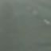
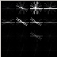
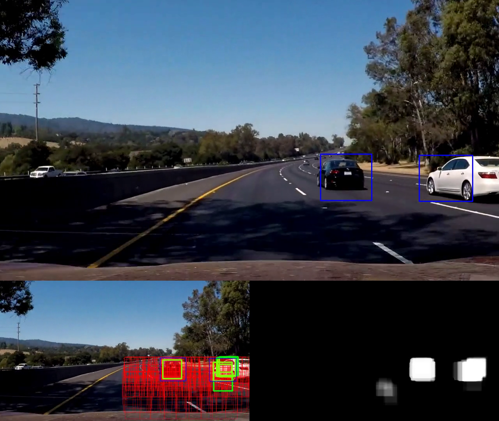

- the hardest part is making it run quickly with so many scanning boxes


-start 128s even farther down


- tracking performance now good
- tried to increase threshold in an attempt to get rid of the few false positives that show up
- hopefully this doesn't eliminate true positives as well
- if bad - can decrease the amount that gets added to the heatmap for each positive returned by the classifier


## Writeup Template
### You can use this file as a template for your writeup if you want to submit it as a markdown file, but feel free to use some other method and submit a pdf if you prefer.

---

**Vehicle Detection Project**

The goals / steps of this project are the following:

* Perform a Histogram of Oriented Gradients (HOG) feature extraction on a labeled training set of images and train a classifier Linear SVM classifier
* Optionally, you can also apply a color transform and append binned color features, as well as histograms of color, to your HOG feature vector. 
* Note: for those first two steps don't forget to normalize your features and randomize a selection for training and testing.
* Implement a sliding-window technique and use your trained classifier to search for vehicles in images.
* Run your pipeline on a video stream (start with the test_video.mp4 and later implement on full project_video.mp4) and create a heat map of recurring detections frame by frame to reject outliers and follow detected vehicles.
* Estimate a bounding box for vehicles detected.

## [Rubric](https://review.udacity.com/#!/rubrics/513/view) Points
### Here I will consider the rubric points individually and describe how I addressed each point in my implementation.  

---
### Writeup / README

#### 1. Provide a Writeup / README that includes all the rubric points and how you addressed each one.  You can submit your writeup as markdown or pdf.  [Here](https://github.com/udacity/CarND-Vehicle-Detection/blob/master/writeup_template.md) is a template writeup for this project you can use as a guide and a starting point.  

You're reading it!

### Histogram of Oriented Gradients (HOG)

#### 1. Explain how (and identify where in your code) you extracted HOG features from the training images.

The code for this step is contained in lines 10 through 30 of the file called `vehicle_features.py`). This function `get_hog_features` is used by the function `extract_features_img`, which exists in the same file on lines 32 through 69 and is in turn used by the `extract_features` function, which operates on a list of image filepaths. The similar function `extract_features_imgs` is used by the `detect_objects` function. `extract_features` is used in training, while `extract_features_imgs` is used for processing video data with sliding windows.

I started by reading in all the `vehicle` and `non-vehicle` images.  Here is an example of one of each of the `vehicle` and `non-vehicle` classes:

| Vehicle | Non-Vehicle |
|:---:|:---:|
|  |  |

After exploring using different channels and combinations of channels from different colour spaces, I settled on using all channels from the HSL representation of the input image(s). I also spent some time manually adjusting the `orientations`, `pixels_per_cell`, and `cells_per_block`, and found that values of 9, (16,16), and (2,2), respectively, produced good results. These, along with the colour space and channel choices are the required arguments for `skimage.hog()`.

I used images from the training and test data to gain a qualitative understanding of the  each of the two classes. I displayed the image by passing `True` to the `vis` parameter of `getHogFeatures` or by inserting a call to `cv2.imshow` within the function to get a feel for what the `skimage.hog()` output looks like.

Here is an example using the `HLS` color space and HOG parameters of `orientations=9`, `pixels_per_cell=(16, 16)` and `cells_per_block=(2, 2)`:


#### 2. Explain how you settled on your final choice of HOG parameters.

I spent a large amount of time manually adjusting and testing the HOG parameters. I also started with the suggestions from the udacity lessons and the `skimage.features.hog` documentation. Once I felt that the HOG parameters were producing reasonable features (based on the train and test set accuracies), I froze the values.

#### 3. Describe how (and identify where in your code) you trained a classifier using your selected HOG features (and color features if you used them).

I trained a linear SVM using a features vector composed of both HOG information (as described in the previous section) and colour histograms. See lines 62 to 64 in vehicle_features.py function `extract_features_img` for code that calculated the colour histograms for each input image.

SVM training itself happens in `vehicle_detect.py`, on lines 67 through 167. This training process uses all images from the KITTI and GTI data sets (conveniently provided by the udacity course in a 2 zip files - one for vehicles, one for non-vehicles.

### Sliding Window Search

#### 1. Describe how (and identify where in your code) you implemented a sliding window search.  How did you decide what scales to search and how much to overlap windows?

I formulated my sliding window strategy through experimentation. The final set of sliding windows that I used was:

```code
windows = \
[
	(128, 128, 64, 64, 0.65, 0.9, 0.5, 1.0, 1.0),
	(64, 64, 32, 32, 0.55, 0.7, 0.5, 1.0, 1.0),
	(96, 96, 48, 48, 0.55, 0.7, 0.5, 1.0, 1.0),

	(128, 128, 64, 64, 0.65, 0.9, 0.5, 1.0, 1.0),
	(128, 128, 48, 48, 0.7, 1.0, 0.5, 1.0, 1.0),
	(64, 64, 32, 32, 0.55, 0.7, 0.5, 1.0, 0.5),
	
	(96, 96, 48, 48, 0.55, 0.7, 0.5, 1.0, 1.0),

	(96, 96, 36, 36, 0.54, 0.7, 0.5, 1.0, 1.0),

	(96, 96, 24, 24, 0.55, 0.7, 0.5, 1.0, 1.0)
]
```

Each of these represents a different sliding window. The parameters from left to right are:
1. height (rows) - the height of the sliding window, in pixels
2. width (cols) - the width of the sliding window, in pixels
3. scan_height (rows) - the translation height of the sliding window, in pixels
4. scan_width (cols) - the translation width of the sliding window, in pixels
5. first_row - the row of the image to start on, expressed as a fraction of the number of rows in the image
6. last_row - the last row of the image to process, expressed as a fraction of the number of rows in the image
7. first_col - the column of the image to start on, expressed as a fraction of the number of columns in the image
8. last_col - the last column of the image to process, expressed as a fraction of the number of columns in the image
9. keep_prob - the probility for processing a window. Ex, 0.6 means there is a 60% chance that the window will be processed. The point of this option was to enable speed improvements by relying on the framerate of the camera to fill in missing information over time, since not all of the sliding window positions would be predicted in each frame (but over time one could expect uniform coverage of the search area).

In addition, the sliding window search implementation slides the windows back and forth by up to half the translation dimensions for each frame. The intention with this modification was to enable smoother tracking without a performance impact by again exploiting the fact that the camera frame rate is quite high (and so we only need to cover the search area uniformly over time, not necessarily in every frame). The output images shown below are split to show the original image with the detected boxes drawn (on top), the heatmap (on the bottom right), and the sliding window search and results (on the bottom left). the organization of the windows changes from frame to frame due to the randomness introduced as described above.

#### 2. Show some examples of test images to demonstrate how your pipeline is working.  What did you do to optimize the performance of your classifier?

Ultimately I searched on 3 scales scales using all channels of the HSL input image to form HOG features (structural features) and histograms of color (colour features). The HOG features and colour features were combined to produce the final feature vector, which provided good vehicle tracking performance.

To optimize the performance of my classifier, I introduced a small amount of randomness in window position as described in the previous section. The previous section also explains why this improves the speed of the algorithm. In addition, I limited the sliding window search area to search only areas of the image in which I expected vehicle detections to occur.

Example images:

Overall image:


Sample HOG feature images are shown in the table below.

| HSL image | Features |
|:---:|:---:|
|||
|||

### Video Implementation

#### 1. Provide a link to your final video output.  Your pipeline should perform reasonably well on the entire project video (somewhat wobbly or unstable bounding boxes are ok as long as you are identifying the vehicles most of the time with minimal false positives.)
Here's a [link to my video result](./project_video_output.mp4)


#### 2. Describe how (and identify where in your code) you implemented some kind of filter for false positives and some method for combining overlapping bounding boxes.

I recorded the bounding boxes of vehicle detections from each frame of the video. From these positive detections I created a heatmap and then thresholded that map to produce a binary image representing vehicle detections.  I then used `cv2.findContours` and `cv2.boundingRect` to identify vehicle detections in the heatmap.  The outputs of `boundingRect` were my vehicle detections.  

Here's an example result showing the the following information from a series of frames of video:
- Original image with vehicle detections drawn as blue bounding boxes
- The heatmap (before thresholding)
- The results of sliding window search (before false positive elimination)

### Here are six frames and their corresponding heatmaps:

Please see 2 sections below - I combined different information together in a single image output.

### Here is the output of `cv2.findContours + cv2.boundingRect` on the integrated heatmap from all six frames:

Please see 1 section below - I combined different information together in a single image output.

### Here the resulting bounding boxes are drawn onto the last frame in the series:

I show more than 6 images here because you can see the heatmap eliminate a false positive vehicle detection over time. The location of the false positive is the bottom middle of the heatmap.

| Even Numbered Frames | Odd Numbered Frames |
|:---:|:---:|
|  |  | 
|  |  |
|  |  |
|  |  |
|  |  |
|  |  |
|  |  |
|  |  |
|  |  |
|  |
---

### Discussion

#### 1. Briefly discuss any problems / issues you faced in your implementation of this project.  Where will your pipeline likely fail?  What could you do to make it more robust?

Here I'll talk about the approach I took, what techniques I used, what worked and why, where the pipeline might fail and how I might improve it if I were going to pursue this project further. 

The main problem I faced in this project was development iteration speed. The typical cycle is:
1. Write some code.
2. Perform a test case in which something of interest happens.
3. Observe the output (in this case manually).
4. If satisfied, done, else go back to step 1.

Lets say it took me N number of iterations to achieve the end goal. Due to the poor speed of the algorithm I developed, Step 2 was extremely lengthy when testing the whole video. Even while testing smaller segments, the time taken for Step 2 was quite large. The discrepancy in runtime between step 2 and the other steps is such that the total development time was composed mostly of my computer generating the output video. To fix this problem in the future, I plan to make more effort to maintain reasonable algorithm performance where possible, rather than completely ignoring it and focusing on results only. However, there is a fine balance required here because it is also not wise to prematurely optimize an algorithm. As the famous quote by Donald Knuth goes: "Premature optimization is the root of all evil ...". Prematurely optimizing can also decrease development speed.

One such performance optimization I probably should have made early on was calculating a histogram of oriented gradients for the whole image. One problem with this is that I wanted to randomly select windows, and I would have had to investigate how to make this work with the pre-calculated data.

As I only tested my pipeline on the one video, I expect that the algorithm does not generically work for all driving conditions. In addition, it is possible that the performance of the algorithm on cars or other vehicles not in the dataset might also be poor. I do plan to come back and test this algorithm in such conditions when I have more time.
