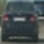

- the hardest part is making it run quickly with so many scanning boxes

-start 128s even farther down

- tracking performance now good
- tried to increase threshold in an attempt to get rid of the few false positives that show up
- hopefully this doesn't eliminate true positives as well
- if bad - can decrease the amount that gets added to the heatmap for each positive returned by the classifier

## Writeup Template
### You can use this file as a template for your writeup if you want to submit it as a markdown file, but feel free to use some other method and submit a pdf if you prefer.

---

**Vehicle Detection Project**

The goals / steps of this project are the following:

* Perform a Histogram of Oriented Gradients (HOG) feature extraction on a labeled training set of images and train a classifier Linear SVM classifier
* Optionally, you can also apply a color transform and append binned color features, as well as histograms of color, to your HOG feature vector. 
* Note: for those first two steps don't forget to normalize your features and randomize a selection for training and testing.
* Implement a sliding-window technique and use your trained classifier to search for vehicles in images.
* Run your pipeline on a video stream (start with the test_video.mp4 and later implement on full project_video.mp4) and create a heat map of recurring detections frame by frame to reject outliers and follow detected vehicles.
* Estimate a bounding box for vehicles detected.

## [Rubric](https://review.udacity.com/#!/rubrics/513/view) Points
### Here I will consider the rubric points individually and describe how I addressed each point in my implementation.  

---
### Writeup / README

#### 1. Provide a Writeup / README that includes all the rubric points and how you addressed each one.  You can submit your writeup as markdown or pdf.  [Here](https://github.com/udacity/CarND-Vehicle-Detection/blob/master/writeup_template.md) is a template writeup for this project you can use as a guide and a starting point.  

You're reading it!

### Histogram of Oriented Gradients (HOG)

#### 1. Explain how (and identify where in your code) you extracted HOG features from the training images.

The code for this step is contained in lines 10 through 30 of the file called `vehicle_features.py`). This function `get_hog_features` is used by the function `extract_features_img`, which exists in the same file on lines 32 through 69 and is in turn used by the `extract_features` function, which operates on a list of image filepaths. The similar function `extract_features_imgs` is used by the `detect_objects` function. `extract_features` is used in training, while `extract_features_imgs` is used for processing video data with sliding windows.

I started by reading in all the `vehicle` and `non-vehicle` images.  Here is an example of one of each of the `vehicle` and `non-vehicle` classes:

| Vehicle | Non-Vehicle |
|:---:|:---:|
|  |  |

After exploring using different channels and combinations of channels from different colour spaces, I settled on using all channels from the HSL representation of the input image(s). I also spent some time manually adjusting the `orientations`, `pixels_per_cell`, and `cells_per_block`, and found that values of 9, (16,16), and (2,2), respectively, produced good results. These, along with the colour space and channel choices are the required arguments for `skimage.hog()`.

I used images from the training and test data to gain a qualitative understanding of the  each of the two classes. I displayed the image by passing `True` to the `vis` parameter of `getHogFeatures` or by inserting a call to `cv2.imshow` within the function to get a feel for what the `skimage.hog()` output looks like.

Here is an example using the `HLS` color space and HOG parameters of `orientations=9`, `pixels_per_cell=(16, 16)` and `cells_per_block=(2, 2)`:

#### 2. Explain how you settled on your final choice of HOG parameters.

I spent a large amount of time manually adjusting and testing the HOG parameters. I also started with the suggestions from the udacity lessons and the `skimage.features.hog` documentation. Once I felt that the HOG parameters were producing reasonable features (based on the train and test set accuracies), I froze the values.

#### 3. Describe how (and identify where in your code) you trained a classifier using your selected HOG features (and color features if you used them).

I trained a linear SVM using...

### Sliding Window Search

#### 1. Describe how (and identify where in your code) you implemented a sliding window search.  How did you decide what scales to search and how much to overlap windows?

I decided to search random window positions at random scales all over the image and came up with this (ok just kidding I didn't actually ;):

![alt text][image3]

#### 2. Show some examples of test images to demonstrate how your pipeline is working.  What did you do to optimize the performance of your classifier?

Ultimately I searched on two scales using YCrCb 3-channel HOG features plus spatially binned color and histograms of color in the feature vector, which provided a nice result.  Here are some example images:

![alt text][image4]
---

### Video Implementation

#### 1. Provide a link to your final video output.  Your pipeline should perform reasonably well on the entire project video (somewhat wobbly or unstable bounding boxes are ok as long as you are identifying the vehicles most of the time with minimal false positives.)
Here's a [link to my video result](./project_video_output.mp4)

#### 2. Describe how (and identify where in your code) you implemented some kind of filter for false positives and some method for combining overlapping bounding boxes.

I recorded the positions of positive detections in each frame of the video.  From the positive detections I created a heatmap and then thresholded that map to identify vehicle positions.  I then used `scipy.ndimage.measurements.label()` to identify individual blobs in the heatmap.  I then assumed each blob corresponded to a vehicle.  I constructed bounding boxes to cover the area of each blob detected.  

Here's an example result showing the heatmap from a series of frames of video, the result of `scipy.ndimage.measurements.label()` and the bounding boxes then overlaid on the last frame of video:

### Here are six frames and their corresponding heatmaps:

![alt text][image5]

### Here is the output of `scipy.ndimage.measurements.label()` on the integrated heatmap from all six frames:
![alt text][image6]

### Here the resulting bounding boxes are drawn onto the last frame in the series:

| Even Numbered Frames | Odd Numbered Frames |
|:---:|:---:|
|  |  | 
|  |  |
|  |  |
|  |  |
|  |  |
|  |  |
|  |  |
|  |  |
|  |  |
|  |
---

### Discussion

#### 1. Briefly discuss any problems / issues you faced in your implementation of this project.  Where will your pipeline likely fail?  What could you do to make it more robust?

Here I'll talk about the approach I took, what techniques I used, what worked and why, where the pipeline might fail and how I might improve it if I were going to pursue this project further. 

The main problem I faced in this project was development iteration speed. The typical cycle is:
1. Write some code.
2. Perform a test case in which something of interest happens.
3. Observe the output (in this case manually).
4. If satisfied, done, else go back to step 1.

Lets say it took me N number of iterations to achieve the end goal. Due to the poor speed of the algorithm I developed, Step 2 was extremely lengthy when testing the whole video. Even while testing smaller segments, the time taken for Step 2 was quite large. The discrepancy in runtime between step 2 and the other steps is such that the total development time was composed mostly of my computer generating the output video. To fix this problem in the future, I plan to make more effort to maintain reasonable algorithm performance where possible, rather than completely ignoring it and focusing on results only. However, there is a fine balance required here because it is also not wise to prematurely optimize an algorithm. As the famous quote by Donald Knuth goes: "Premature optimization is the root of all evil ...". Prematurely optimizing can also decrease development speed.

One such performance optimization I probably should have made early on was calculating a histogram of oriented gradients for the whole image. One problem with this is that I wanted to randomly select windows, and I would have had to investigate how to make this work with the pre-calculated data.

As I only tested my pipeline on the one video, I expect that the algorithm does not generically work for all driving conditions. In addition, it is possible that the performance of the algorithm on cars or other vehicles not in the dataset might also be poor. I do plan to come back and test this algorithm in such conditions when I have more time.
